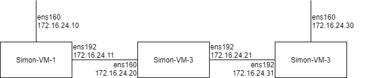

# Considerations for measurement study
There are a number of considerations to think about before we deploy pping for a
measurement study.

## 1. How to save the results?
When running pping locally, just piping the output the JSON output mode to a
file seems like the easiest solution to me and should be sufficient. However, if
we deploy this at some ISP's router I guess they may not want us to store a
massive JSON-file on the router. So I guess we would then either have to
directly stream it to some other storage, or at least occasionally transfer the
output.

Furthermore, should the JSON output be used at all, or should we instead try to
integrate it with some database or Kafka stream or something? I have very little
experience with deploying and running experiments on other people's machines, so
I'm very open to suggestions here.

### Thoughts so far
From what I've gathered, the routers in question have plenty of storage, so we
can probably dump a fair amount of data locally (in the order of GB).

The JSON format currently takes about 175-270 bytes per flow event, and 200-330
bytes per RTT event (depending a bit on type of event, IPv4 or IPv6, values
etc.). For IPv4 addresses I would expect the "typical" length to be
approximately 190 bytes for flow-events and 240 bytes for RTT-events.

How much data is written of course depends on the amount and type of
traffic. For a simple example, let's assume 1000 concurrent non-sparse flows,
each flow lasting about 1 second on average. Using the default rate limit of 100
ms and the "typical" values above, that would then generate 10 RTT-events + 2
flow-events per flow per second, which translates to writing down about 2.8
MB/s, or 10 GB/h.

With this in mind, we should probably aim to collect a relatively short trace
(in the order of hours rather than days/weeks). If we want to collect data over
a longer time, an alternative could be to increase the rate-limit to ex. 1 s
(match typical ping), but then we lose a lot of granularity in the data, making
it hard to analyze shorter flows. It may in fact be more interesting to go in
the other direction, decreasing the sampling rate to say ex. 10 ms to get more
fine-grained data, but then the trace will probably have to be in the order of
minutes.

## 2. What information do we need?
The main-purpose of pping is of course to monitor RTTs. But there may be
additional information that can be useful or relevant for that. For example, it
may be interesting to try and correlate RTTs with traffic intensity, and then it
would be useful to also log ex. nr. of sent and received packets and bytes
(which is something I plan on implementing soon).

There's also the question of minimizing data-collection (only collect what we
know we need, in the GDPR spirit), or collect as much as possible and see if
anything of it turns out to be interesting later when analyzing the result.

As a bit of a side-effect, pping also ends up mapping out all the (TCP) traffic
flows. While this can of course be interesting from some aspects, it's likely
something we may want to anonymize in this case.

### Anonymizing flows
As IP addresses are considered personal identifiers, it's probably something we
want to avoid collecting (and something I also guess the ISP may not want us
logging).

So the question is how we should do this? The easiest way would probably be to
do it with post-processing, but then we optimally need to run this
post-processing before we ever get hold of the data.

Furthermore, to what degree should the anonymization be done? IP-addresses can
contain some potentially useful information, for example are these public or
private IP-addresses (depending on where the router is deployed and if
carrier-grade NAT is used). IP-addresses can typically also be mapped to a
geographical area, which could be of interest if one wants to try and correlate
RTTs with distance between hosts.

Additionally, should only the IP-addresses by anonymized, or should the ports be
to? The ports could reveal to a certain degree what type of services the traffic
is for, which may or may not be interesting. And if they are to be anonymized,
should that be done independently from the IP-addresses (so that one can still
map how different anonymized hosts are mapped to each other), or should each
flow-tuple be anonymized as a whole?

### My thoughts so far
Anonymizing IP addresses turns out to be a non-trivial issue, as anonyimization
in general is [challenging][id-myths]. A number of different issues have been
raised with regards to anonymized network traces, see
ex. [this][priv-risks-anonymIP], [this][devil-trace], [this][tame-devil] or
[this][net-anonym-attack]. By only providing occasional statistics on different
flows rather than full packet traces we do make some attacks less likely to
succeed, but many of the attacks could still be applicable.

[ICANN][ICANN-recommend] and [CAIDA][CAIDA-recommend] have some nice overviews
of anonymization techniques together with some recommendations. A more extensive
review is presented [here][survey-net-anonym]. I have briefly summarized some
common ways to anonymize IP-addresses below:

- Remove the address entirely. While offering the strongest protection, this is
  obviously not a good option for analysis.

- Truncate the address by removing ex. the last byte for IPv4 addresses. This
  would not be suitable for our analysis as we can't isolate single flows
  anymore, and depending on topology the anonymity may be questionable. This
  method is for example used by [Google Analytics][google-anonym].

- Crypto-PAn seems to be fairly common way to create a 1-to-1 mapping of
  addresses and is prefix-preserving (i.e. if the first X bits of two addresses
  are the same, then the first X bits of their anonymized addresses will also be
  the same). Not sure this is a property that's particularly useful for our
  analysis however, and which may weaken the anonymization. This scheme is for
  example used by CAIDA.

- Encrypt the address with AES-128 and a secret key (that you can then proceed
  to throw away). For IPv4 addresses you may truncate it to just 32-bits, but
  then you risk collisions. If you don't truncate the IPv4 addresses it may be a
  good idea to mark them in some other way to be able to separate IPv4 and IPv6
  addresses.

I think we should probably keep the port-numbers. They're both useful for
identifying type of traffic as well as which part of link we're looking at
(i.e. if dest has port 80, it's probably on the side to the public internet,
whereas the src is then probably one of the ISP customers). Both could be
valuable for the analysis.

It may also be a good idea to obscure the timestamps a bit, for example by
subtracting the lowest timestamp from all timestamps. I.e. instead of having a
UNIX-timestamp that tells exactly when the measurements took place, you simple
have a timestamp that tells you when events occurred relative to the start of
the measurements. This may make it harder to attempt to combine the measurements
with external data sources in order to de-anonymize users (ex. using a log from
a web-server to trace visitors global surfing habits). This probably doesn't add
as strong protection as lowering resolution or adding noise would, but these
latter options may pose an issue for the analysis.

Furthermore, while I think data size (packet and byte counts) can be useful for
the analysis, it may be worth to make these optional to collect (partly due to
data minimization, partly due to storage size for logged data, and partly
because it may impact performance of pping). In case we in advance decide that
these are not useful for the analysis, we should not collect them at all.

Finally, we should probably take a look at the ISP's privacy policy to see what
it states about logging network data. It may also be a good idea to check if
anyone in PriSec could take a look at whatever strategy we come up with, as they
are very well versed in privacy issues and the GDPR.

## 3. What to analyze?
Perhaps one of the most important questions is why are we collecting these
measurements? What do we hope to get out of them? What are we analyzing them
for?

We should probably have a good idea of what we want to analyze before we start
to collect measurements in order to apply data minimization. This may also imply
that we should add some options to control how much data pping collects (right
now I think that's mainly if packet and byte counts should be included, which
may also be interesting to turn on/off for performance analysis as it's the only
feature that causes writes to maps for every packet)

My initial thoughts would be to mainly look for variations in RTTs within a flow
to see indications of buffer-bloat, and possibly try to look at how that
correlates with the traffic load. But I should probably read some more papers on
this topic first to get an idea what other's have already done.

### My thoughts so far
At this point my main focus for analysis here is still variation/jitter of RTT
within flows, and potential correlations with traffic intensity and amount of
concurrent flows. It may also be interesting to look at RTT differences between
different flows to see if some "similar" flows have very different RTTs. For
example, if multiple clients connect to the same server, do they get similar
RTTs? Or do flows to the same server change RTT over time?

Another part that could be interesting is to look at the different halfs of the
connection, i.e. between the router and the ISP customer (client), and between
the router and the web-server. However it's worth keeping in mind that the
traffic is likely very asymmetric here (for normal web-surfing, the client would
be expected to generally receive/download much more data than it
sends/uploads). A client downloading data will mainly provide RTTs between the
router and the client (time between router forwarding server-response, until
client ACKs the data), whereas uploading data would mainly provide RTTs between
router and web-server (time between router forwarding client data until server
ACKs it).

There are a number of other things that one could also use the traffic to
analyze, but that should maybe not be the focus.

- Traffic types based on ports, including occurrence of HTTP vs HTTPs

- To what degree IPv6 is used (unless we anonymize away the difference between
  IPv4 and IPv6 addresses)

- Looking at traffic patterns in various ways (packet sizes, upload/download
  asymmetry, flow length, nr. concurrent flows to the same client etc.)

- Impact of time of day (unless we remove absolute timestamps)

- ...probably a bunch of other things

## 4. Performance test and analysis
Another interesting aspect is of course the performance of pping. Our hope is to
make it something that can be always on, but does this version of it achieve
that? How much more efficient is it than Kathie's pping? To do this we should
probably setup some type of synthetic benchmark where we can compare some
different scenarios (single heavy flow, multiple heavy flow, massive amount of
flows etc.).

### My thoughts so far
Test setup should probably consist of at least 3 machines (physical or virtual):

- Traffic generator, not on same machine as pping to avoid performance interference.

- Middlebox dedicated to pping which traffic passes through

  - In addition to pping it's probably a good idea to also run normal ping to
    verify the accuracy of pping.

  - This is mainly relevant if we first implement ICMP echo support to pping, so
    that the RTT reported by ping can be compared to the RTT reported by pping
    for the same packets that ping generated.

- Data sink (for the traffic generator), not on the same machine as pping to
  avoid performance interference.

Exactly how to configure these is still very much an open issue.

The performance measurements should look at CPU and memory usage for pping
(i.e. how much resources does original and eBPF version of pping use), as well
as overall effect on throughput (what is the maximum line rate the pping
versions can manage).

For the eBPF version of pping it may be of interest to try and time the
execution time of BPF-programs, as it may be hard to directly measure their CPU
usage (not being a userspace process). May also just run with pping on/off to
observe difference.

Setting up traffic generators to reach sufficiently high packet rates can
apparently be challenging. Suggestions for packet generators:

- [TRex](https://trex-tgn.cisco.com/)

- [MoonGen][MoonGen-github] - [paper][MoonGen-paper]

- [pktgen][pktgen-doc] - [paper][pktgen-paper]


[ICANN-recommend]: https://www.icann.org/en/system/files/files/rssac-040-07aug18-en.pdf
[CAIDA-recommend]: https://www.caida.org/projects/impact/anonymization/
[google-anonym]: https://support.google.com/analytics/answer/2763052
[id-myths]:  https://www.cs.utexas.edu/~shmat/shmat_cacm10.pdf "Alt. link: https://www.doi.org/10.1145/1743546.1743558"
[priv-risks-anonymIP]: https://www.doi.org/10.1007/11909033_3
[devil-trace]: http://www.icir.org/enterprise-tracing/devil-ccr-jan06.pdf "Alt. link: https://doi.org/10.1145/1111322.1111330"
[tame-devil]: https://www.cs.colostate.edu/~cs656/papers-to-read/p00-coull.pdf "Alt. link: https://doi.org/10.7916/D8BC47W0"
[net-anonym-attack]: https://www.researchgate.net/publication/202120661_The_Role_of_Network_Trace_Anonymization_under_Attack "Alt. link http://doi.acm.org/10.1145/1672308.1672310"
[survey-net-anonym]: https://doi.org/10.1145/3182660
[pktgen-doc]: https://www.kernel.org/doc/Documentation/networking/pktgen.txt
[pktgen-paper]: http://kth.diva-portal.org/smash/get/diva2:919045/FULLTEXT01.pdf
[MoonGen-github]: https://github.com/emmericp/MoonGen
[MoonGen-paper]: https://www.net.in.tum.de/fileadmin/bibtex/publications/papers/MoonGen_IMC2015.pdf

### Initial setup (2021-06-21)
Javid has granted me access to 3 VMs I can use to do the performance test(s).

Current VM specifications:
| OS | Ubuntu server 20.04.02 |
| Kernel | 5.4.0-74-generic |
| CPU | 4 x Intel(R) Xeon(R) CPU E5-2630 v3 @ 2.40GHz |
| RAM | 4 GB |
| Storage | ~20 GB |
| Network | 2 x VMXNET3 Ethernet Controller |

**Problem**: The VMXNET3 drivers do not have XDP support (so runs in XDP generic
mode). Also have no idea how the underlying infrastructure/hardware is set up
like. If they all run on the same machine or not, and to what degree they may or
may not share resources with other VMs.

I have tried to set up the machines in the following way:


As I have no idea what I'm doing, here's the possibly stupid way I did it.
On VM-1:
```shell
ip route add 172.16.24.31/32 via 172.16.24.20 dev ens192
```

On VM-2:
```shell
ip route add 172.16.24.11/32 dev ens160
ip route add 172.16.24.31/32 dev ens192
sysctl -w net.ipv4.ip_forward=1
```

On VM-3:
```shell
ip route add 172.16.24.11/32 via 172.16.24.21 dev ens192
```

Simon-VM-1 and Simon-VM-3 are intended to be used as traffic generators/sinks,
and Simon-VM-2 acts as a middlebox between this traffic, where both Kathie's pping
and my eBPF pping have been installed.

#### Some simple iperf3 tests
**NOTE:** CPU-performance has simply been measured with mpstat and then
eyeballed. Results have no statistical significance at all and should be taken
with a grain of salt. With 100% CPU utilization I mean 100% of a single core, so
all cores being fully utilized corresponds to 400%.

##### Without pping
Running iperf3 with a single TCP flow, sending traffic directly from VM-1 to
VM-3 (sending from 172.16.24.10 to 172.16.24.30), I hit about 30 Gbit/s
(typically varies between 25-33). CPU load at both sender and receiver is
typically around 100% (all distributed on a single core). Using 10 parallel
flows instead doesn't change much, but seems to allow for a slightly more
distributed load at the receiver (using one core at 85-90%, and a couple of
other cores to a small degree).

When sending a single TCP flow through VM-2 (sending from 172.16.24.11 to
172.16.24.31), the throughput goes down to about 14 Gbit/s (varies between
roughly 12-16) and some retransmissions start occurring. In VM-2 CPU utalization
is around 90-100%, where mainly a single core is used. The receiver also uses
about 100% CPU, but distributed across two cores, and the sender seems to vary
between roughly 30-45% CPU usage (using a single core). When instead using 10
parallel flows, the throughput drops to about 10 Gbit/s. The CPU utilization for
VM-2 drops drastically to just 8-20% (distributed across 2-4 of the cores),
whereas for the sender it seems to increase to around 45% for a single core, and
for the receiver at around 95%, with one core around 85% utilized and the rest
spread out on other cores.

##### With pping
**NOTE:** Starting very simple, I've only been running a single instance of
pping on VM-2 at the ens192 interface (the one connected to VM-3). That means
that eBPF pping should mainly report RTTs for data sent from VM-1 (and acked by
VM-3), but Katie's pping will also report RTTs when data is sent in the other
direction (VM-3 to VM-1) for two reasons.

Kathie's pping will attempt to both timestamp and match each packet, regardless
of it's ingress or egress. So it will be able to create timestamps for data
packets sent from VM-3 as they're received on ens192 at VM-2, and match them
against the ACK sent from VM-1 as it is forwarded and transmitted by ens192 on
VM-2, getting the RTT(+local processing) between VM-2 and VM-1, which can be
considered valid behavior. However, eBPF pping will only timestamp transmitted
packets, and only attempt to match received packets. It will therefore only
report RTTs for data transmitted on the monitored interface. To get the RTTs
between VM-2 and VM-1 in this case, eBPF pping would have to be attached ens160
as well (whereas Kathie's pping would essentially report each RTT twice if
attached to both interfaces, with the internal forwarding delay on ens192 and
without on ens160).

Kathie's pping will also timestamp pure ACKs (and then match against them). For
applications that constantly tries to transmit data (like iperf), this works
reasonably well, but may create erroneous RTTs that includes time between the
application attempting to transmit data. If the application for example only
attempts to transmit a message every 60 seconds, then this 60-second gap may be
included in the calculated RTT when timestamping pure ACKs.

The effect of this is that Kathie's pping will report RTTs in both directions,
even if data is only transmitted in a single direction. My eBPF pping on the
other hand will only report RTTs in the direction data is transmitted, AND the
data also has to be transmitted from the view of the monitored interface.

Guess all this about how Kathie's pping and my eBPF pping differs should be
included in some form of documentation for pping rather than as a note here...
**End of multi-paragraph note**

When running Kathie's pping tool with a single TCP flow, the throughput seems to
go down slightly to around 12-13 Gbit/s. The CPU utilization for VM-2 increases
to about 200-220% across mainly two cores, so basically pping uses 100% of an
additional core. Even if decreasing the throughput to 8 Gbit/s (by telling
iperf3 to transmit at that rate), the core that seems to run pping (mainly
userspace load) seems to be pegged at 100%. When using 10 parallel streams,
throughput is still around 10 Gbit/s, and CPU utilization at VM-2 drops slightly
to about 180% and the load seems to be a bit more distributed across the
cores. The core that seems to run pping is still pegged at 100%, but the
forwarding (software-interrupts) is a bit more spread out, often partly using
2-3 cores.

When running my eBPF pping with a single TCP flow, no clear decrease in
throughput is observed (still at around 14 Gbit/s with some variations). CPU
load seems also seems to be fairly similar to when not running pping at all,
possibly slightly higher. However my eBPF pping by default outputs much less
information at its default sample rate of only one RTT every 100ms. If the rate
sampling is disabled (to get a more fair comparison to Kathie's pping), load
seems to go up slightly, with there now also being a userspace load of about
2-3%.

When instead using 10 parallel TCP streams, throughput and CPU load is once
again quite similar to when not running pping at all (which means about 10
Gbit/s throughput and CPU load decreasing to just about 12-20%). However, when
switching off rate sampling again performance gets much worse, with CPU
utilization at around 100-120%, with one core at around 60-70% and the rest more
evenly distributed. Around 10-15% CPU is now spent in userspace processing,
which interestingly enough seems to be distributed across the cores. I guess
this is simply due to task switching as mpstat only gives one value per second,
and the userspace pping process should only use two threads (one for printing
out the RTT messages, and one for cleaning the map). The timestamp map now fills
with around 3000 entries, which is somewhat worrying considering it's only for
10 flows (many timestamps likely never matched due to retransmissions, delayed
ACKs etc, and have to be deleted by userspace).

Running the traffic the other direction (sending data from VM-3 to VM-1) is also
very problematic for eBPF pping. While my eBPF pping doesn't end up reporting
any RTTs (other than the one from the initial SYN handshake), it cripples the
throughput, decreasing it to around 5 Gbit/s. This seems to mainly be an effect
of XDP disabling GRO, as even when only loading a minimal XDP program the
performance is similar.

```c
#include <linux/bpf.h>
#include <bpf/bpf_helpers.h>

SEC("xdp")
int dummy_prog(struct xdp_md *ctx)
{
	return XDP_PASS;
}
```
