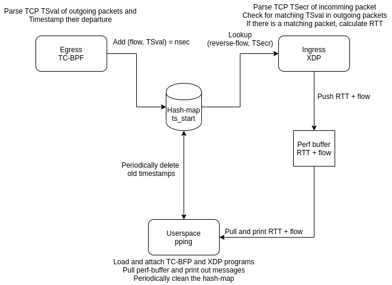

# PPing using XDP and TC-BPF
A re-implementation of [Kathie Nichols' passive ping
(pping)](https://github.com/pollere/pping) utility using XDP (on ingress)
and TC-BPF (on egress) for the packet capture logic.

## Simple description
Passive Ping (PPing) makes use of the TCP Timestamp option to calculate the RTT for TCP traffic passing through.
PPing can be used on measure RTTs on end hosts or any device which sees both directions of the TCP flow.

For outgoing packets, it checks for TCP timestamp TSval in the TCP header. If it finds one it creates a timestamp
for when it saw that TSval in a particular flow. On incomming packets it parses the TCP timestamp TSecr (which
is the TSval echoed by the receiving host) and checks it has seen any previous outgoing packets with that TCP
timestamp. If it has, an RTT is calculated as the difference in time between when it saw an outgoing packet
with a TSval, and when it received an incomming packet from the reverse flow with a matching TSecr.

Note that TCP timestamps may not be unique for every packet in a flow, therefore it only matches the first
outgoing packet with a particular TSval with the first incomming packet with a matching TSecr. Duplicate
TSval/TSecr are ignored.

## Planned design

