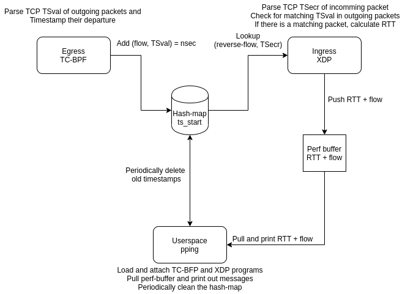

# PPing using XDP and TC-BPF
A re-implementation of [Kathie Nichols' passive ping
(pping)](https://github.com/pollere/pping) utility using XDP or TC-BPF (on
ingress) and TC-BPF (on egress) for the packet capture logic.

## Simple description
Passive Ping (PPing) is a simple tool for passively measuring per-flow RTTs. It
can be used on endhosts as well as any (BPF-capable Linux) device which can see
both directions of the traffic (ex router or middlebox). Currently it works for
TCP traffic which uses the TCP timestamp option and ICMP echo messages, but
could be extended to also work with for example TCP seq/ACK numbers, the QUIC
spinbit and DNS queries. See the [TODO-list](./TODO.md) for more potential
features (which may or may not ever get implemented).

pping parses each packet starting from its Ethernet header. Interfaces that
carry no Ethernet header -- PPP/PPPoE uplinks, tun, and other L3 interfaces --
are detected automatically and parsed from the IP header instead.

The fundamental logic of pping is to timestamp a pseudo-unique identifier for
packets, and then look for matches in the reply packets. If a match is found,
the RTT is simply calculated as the time difference between the current time and
the stored timestamp.

This tool, just as Kathie's original pping implementation, uses TCP timestamps
as identifiers for TCP traffic. The TSval (which is a timestamp in and of
itself) is used as an identifier and timestamped. Reply packets in the reverse
flow are then parsed for the TSecr, which are the echoed TSval values from the
receiver. The TCP timestamps are not necessarily unique for every packet (they
have a limited update frequency, which appears to be 1000 Hz for modern Linux
systems), so only the first instance of an identifier is timestamped, and
matched against the first incoming packet with a matching reply identifier. The
mechanism to ensure only the first packet is timestamped and matched differs
from the one in Kathie's pping, and is further described in
[SAMPLING_DESIGN](./SAMPLING_DESIGN.md).

For ICMP echo, it uses the echo identifier as port numbers, and echo sequence
number as identifier to match against. Linux systems will typically use different
echo identifiers for different instances of ping, and thus each ping instance
will be recognized as a separate flow. Windows systems typically use a static
echo identifier, and thus all instances of ping originating from a particular
Windows host and the same target host will be considered a single flow.

## Output formats
pping currently supports 4 different formats, *standard*, *ppviz*, *json* and *jsonl*. In
general, the output consists of two different types of events, flow-events which
give information that a flow has started/ended, and RTT-events which provide
information on a computed RTT within a flow.

### Standard format
The standard format is quite similar to Kathie's pping default output, and
is generally intended to be an easily understood human-readable format writing a
single line per event.

An example of the format is provided below:
```shell
16:00:46.142279766 TCP 10.11.1.1:5201+10.11.1.2:59528 opening due to SYN-ACK from dest
16:00:46.147705205 5.425439 ms 5.425439 ms TCP 10.11.1.1:5201+10.11.1.2:59528
16:00:47.148905125 5.261430 ms 5.261430 ms TCP 10.11.1.1:5201+10.11.1.2:59528
16:00:48.151666385 5.972284 ms 5.261430 ms TCP 10.11.1.1:5201+10.11.1.2:59528
16:00:49.152489316 6.017589 ms 5.261430 ms TCP 10.11.1.1:5201+10.11.1.2:59528
16:00:49.878508114 TCP 10.11.1.1:5201+10.11.1.2:59528 closing due to RST from dest
```

### ppviz format
The ppviz format is primarily intended to be used to generate data that can be
visualized by Kathie's [ppviz](https://github.com/pollere/ppviz) tool. The
format is essentially a CSV format, using a single space as the separator, and
is further described [here](http://www.pollere.net/ppviz.html).

Note that the optional *FBytes*, *DBytes* and *PBytes* from the format
specification have not been included here, and do not appear to be used by
ppviz. Furthermore, flow events are not included in the output, as those are
not used by ppviz.

An example of the format is provided below:
```shell
1623420121.483727575 0.005298909 0.005298909 10.11.1.1:5201+10.11.1.2:59532
1623420122.484530934 0.006016639 0.005298909 10.11.1.1:5201+10.11.1.2:59532
1623420123.485899736 0.005590783 0.005298909 10.11.1.1:5201+10.11.1.2:59532
1623420124.490584753 0.006123511 0.005298909 10.11.1.1:5201+10.11.1.2:59532
1623420125.492190751 0.005624835 0.005298909 10.11.1.1:5201+10.11.1.2:59532
```
### JSON format
The JSON format is primarily intended to be machine-readable, and thus uses no
spacing or newlines between entries to reduce the overhead. External tools such
as [jq](https://stedolan.github.io/jq/) can be used to pretty-print the format.

The format consists of an array at the root-level, and each flow or RTT event is
added as an object to the root-array. The events contain some additional fields
in the JSON format which are not displayed by the other formats. All times
(*timestamp*, *rtt* and *min_rtt*) are provided as integers in nanoseconds.

An example of a (pretty-printed) flow-event is provided below:
```json
{
    "timestamp": 1623420837244545000,
    "src_ip": "10.11.1.1",
    "src_port": 5201,
    "dest_ip": "10.11.1.2",
    "dest_port": 59572,
    "protocol": "TCP",
    "flow_event": "opening",
    "reason": "SYN-ACK",
    "triggered_by": "dest"
}
```

An example of a (pretty-printed) RTT-event is provided below:
```json
{
    "timestamp": 1623420838254558500,
    "src_ip": "10.11.1.1",
    "src_port": 5201,
    "dest_ip": "10.11.1.2",
    "dest_port": 59572,
    "protocol": "TCP",
    "rtt": 5977708,
    "min_rtt": 5441848,
    "sent_packets": 9393,
    "sent_bytes": 492457296,
    "rec_packets": 5922,
    "rec_bytes": 37,
    "match_on_egress": false
}
```

### JSON Lines format
The JSON Lines (`jsonl`) format contains the same per-event objects as the JSON
format, but emits them as a [JSON Lines](https://jsonlines.org/) stream: one
JSON object per line, with no enclosing array. The JSON format wraps all events
in a single root-level array, which can only be parsed once that array is closed
and which produces invalid (concatenated) arrays if the output is appended to
across several runs. The jsonl format instead produces an append-only log that
can be read line by line and stays valid as it grows, which is convenient for
streaming the output into a file or processing it with line-oriented tools (each
line is independently valid JSON).

The objects and their fields are identical to the [JSON format](#json-format);
only the framing differs. An example flow-event (a single line, wrapped here for
readability) is:
```json
{"timestamp":1623420837244545000,"src_ip":"10.11.1.1","src_port":5201,"dest_ip":"10.11.1.2","dest_port":59572,"protocol":"TCP","flow_event":"opening","reason":"SYN-ACK","triggered_by":"dest"}
```

## Aggregated output
With `-a`/`--aggregate <seconds>` pping instead reports RTT histograms and
traffic counters aggregated per subnet at the given interval, and the
individual flow and RTT events are disabled. The subnet sizes default to /24
for IPv4 and /48 for IPv6 and can be changed with `--aggregate-subnets-v4` and
`--aggregate-subnets-v6`. RTTs are aggregated on the source IP of the reply
packet, or on its destination IP with `--aggregate-reverse`. Subnet entries
that have seen no traffic for 30 seconds are removed (`--aggregate-timeout`).
Aggregated output works with the standard, json and jsonl formats (ppviz does
not support it).

The output starts with a metadata record describing the aggregation settings,
followed at each interval by one record per subnet and a record with global
protocol counters. The RTTs are collected in histograms with 250 bins of 4 ms
each (RTTs beyond the range of the histogram are counted in the last bin). The
standard format summarizes the histograms as count/min/mean/median/p95/max,
and the json and jsonl formats also include the histogram itself. The entry
reported as 0.0.0.0/0 or ::/0 is the backup entry, which collects traffic that
does not get a subnet entry of its own (for example when the aggregation map
is full).

An example of the standard format is provided below:
```shell
Aggregating RTTs in histograms with 250 4 ms wide bins every 5 seconds
16:04:55.561548117: 2001:db8:b861::/48 -> rxpkts=1240, rxbytes=216260, txpkts=1289, txbytes=1000314, rtt-count=1, min=2.48935 ms, mean=2 ms, median=2 ms, p95=2 ms, max=2.48935 ms
16:04:55.561548117: 2001:db8:e60::/48 -> rxpkts=2, rxbytes=680, txpkts=4, txbytes=2968, rtt-count=1, min=256.777 ms, mean=258 ms, median=258 ms, p95=258 ms, max=256.777 ms
16:04:55.561548117: 2001:db8:c14::/48 -> rxpkts=8, rxbytes=866, txpkts=8, txbytes=576
16:04:55.561548117: ::/0 -> rxpkts=1654, rxbytes=1111637, txpkts=1597, txbytes=319003
16:04:55.573621826: TCP=(pkts=521, bytes=82026), UDP=(pkts=3972, bytes=1882961), ICMP=(pkts=21, bytes=2862), ICMPv6=(pkts=264, bytes=51986), ECN=(Not-ECT=4759, ECT0=19)
```

An example of the jsonl format (the metadata record, one subnet record and the
global counters record; one object per line):
```json
{"timestamp":1783070692082600725,"bins":250,"bin_width_ns":4000000,"aggregation_interval_ns":5000000000,"timeout_interval_ns":30000000000,"ipv4_prefix_len":24,"ipv6_prefix_len":48}
{"timestamp":1783070697829042423,"ip_prefix":"2001:db8:b861::/48","rx_stats":{"TCP_TS":{"packets":38,"bytes":13386},"TCP_noTS":{"packets":146,"bytes":30186},"other":{"packets":1686,"bytes":281948}},"tx_stats":{"TCP_TS":{"packets":34,"bytes":16200},"TCP_noTS":{"packets":129,"bytes":41983},"other":{"packets":1791,"bytes":1593387}},"count_rtt":10,"min_rtt":48967,"mean_rtt":1.88e+07,"median_rtt":1e+07,"p95_rtt":4.2e+07,"max_rtt":42344639,"histogram":[5,0,0,0,1,0,0,0,1,0,3]}
{"timestamp":1783070697835435811,"protocol_counters":{"TCP":{"packets":1164,"bytes":1714376},"UDP":{"packets":6935,"bytes":3247411},"ICMP":{"packets":81,"bytes":6536},"ICMPv6":{"packets":277,"bytes":54435}},"ecn_counters":{"no_ECT":8449,"ECT1":6,"ECT0":2},"errors":{}}
```

## Running as a systemd service
The [systemd-files](./systemd-files) directory contains unit files for running
pping as a templated systemd service on a given interface, ex `systemctl start
pping@eth0`. The service writes json output to `/var/log/pping/<interface>/`,
and a timer runs
[scripts/rotate-pping-output.sh](./scripts/rotate-pping-output.sh) every
minute, which moves the output file to a dated folder, signals pping with
SIGHUP to reopen its output file and compresses the moved file. The units
expect this repository to be installed under /opt/bpf-examples.

The [scripts](./scripts) directory also contains cleanup-tc-progs.sh, which
removes leftover pping tc filters from an interface, ex from a previous run
that was killed before it could detach its programs.

## Design and technical description


### Files:
- **pping.c:** Userspace program that loads and attaches the BPF programs (the
  tc programs through TCX links on kernel 6.6+, otherwise through the legacy
  clsact hook), pulls the perf-buffer `events` to print out
  RTT messages and periodically cleans up the hash-maps from old entries. Also
  passes user options to the BPF programs by setting a "global variable"
  (stored in the programs .rodata section).
- **pping_kern.c:** Contains the BPF programs that are loaded on egress (tc) and
  ingress (XDP or tc), as well as several common functions, a global constant
  `config` (set from userspace) and map definitions. Essentially the same pping
  program is loaded on both ingress and egress. All packets are parsed for both
  an identifier that can be used to create a timestamp entry `packet_ts`, and a
  reply identifier that can be used to match the packet with a previously
  timestamped one in the reverse flow. If a match is found, an RTT is calculated
  and an RTT-event is pushed to userspace through the perf-buffer `events`. For
  each packet with a valid identifier, the program also keeps track of and
  updates the state of the flow and reverse flow, stored in the `flow_state` map.
- **pping.h:** Common header file included by `pping.c` and
  `pping_kern.c`. Contains some common structs used by both (are part of the
  maps).

### BPF Maps:
- **flow_state:** A hash-map storing some basic state for each flow, such as the
  last seen identifier for the flow and when the last timestamp entry for the
  flow was created. Entries are created, updated and deleted by the BPF pping
  programs. Leftover entries are eventually removed by userspace (`pping.c`).
- **packet_ts:** A hash-map storing a timestamp for a specific packet
  identifier. Entries are created by the BPF pping program if a valid identifier
  is found, and removed if a match is found. Leftover entries are eventually
  removed by userspace (`pping.c`).
- **events:** A perf-buffer used by the BPF programs to push flow or RTT events
  to `pping.c`, which continuously polls the map and prints them out.
- **map_v4_agg1/map_v4_agg2 and map_v6_agg1/map_v6_agg2:** Per-subnet
  aggregation maps used with `--aggregate`, one pair per IP version. The BPF
  programs update one instance while `pping.c` reports and clears the other,
  swapping between them at each aggregation interval
  (`map_active_agg_instance` tells the BPF programs which instance to use).


## Similar projects
Passively measuring the RTT for TCP traffic is not a novel concept, and there
exists a number of other tools that can do so. A good overview of how passive
RTT calculation using TCP timestamps (as in this project) works is provided in
[this paper](https://doi.org/10.1145/2523426.2539132) from 2013.

- [pping](https://github.com/pollere/pping): This project is largely a
  re-implementation of Kathie's pping, but by using BPF and XDP as well as
  implementing some filtering logic the hope is to be able to create an always-on
  tool that can scale well even to large amounts of massive flows.
- [ppviz](https://github.com/pollere/ppviz): Web-based visualization tool for
  the "machine-friendly" (-m) output from Kathie's pping tool. Running this
  implementation of pping with --format="ppviz" will generate output that can be
  used by ppviz.
- [tcptrace](https://github.com/blitz/tcptrace): A post-processing tool which
  can analyze a tcpdump file and among other things calculate RTTs based on
  seq/ACK numbers (`-r` or `-R` flag).
- **Dapper**: A passive TCP data plane monitoring tool implemented in P4 which
  can among other things calculate the RTT based on the matching seq/ACK
  numbers. [Paper](https://doi.org/10.1145/3050220.3050228). [Unofficial
  source](https://github.com/muhe1991/p4-programs-survey/tree/master/dapper).
- [P4 Tofino TCP RTT measurement](https://github.com/Princeton-Cabernet/p4-projects/tree/master/RTT-tofino): 
  A passive TCP RTT monitor based on seq/ACK numbers implemented in P4 for
  Tofino programmable switches. [Paper](https://doi.org/10.1145/3405669.3405823).
