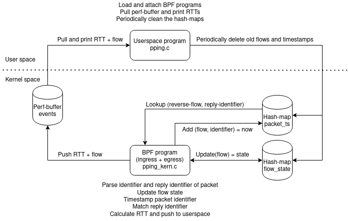

# PPing using XDP and TC-BPF
A re-implementation of [Kathie Nichols' passive ping
(pping)](https://github.com/pollere/pping) utility using XDP (on ingress) and
TC-BPF (on egress) for the packet capture logic.

## Simple description
Passive Ping (PPing) is a simple tool for passively measuring per-flow RTTs. It
can be used on endhosts as well as any (BPF-capable Linux) device which can see
both directions of the traffic (ex router or middlebox). Currently it only works
for TCP traffic which uses the TCP timestamp option, but could be extended to
also work with for example TCP seq/ACK numbers, the QUIC spinbit and ICMP
echo-reply messages. See the [TODO-list](./TODO.md) for more potential features
(which may or may not ever get implemented).

The fundamental logic of pping is to timestamp a pseudo-unique identifier for
outgoing packets, and then look for matches in the incoming packets. If a match
is found, the RTT is simply calculated as the time difference between the
current time and the timestamp.

For Kathie's pping implementation, as well as this one, TCP timestamps are used
as the identifiers. For outgoing packets, the TSval (which is a timestamp in and
off itself) is timestamped. Incoming packets are then parsed for the TSecr,
which are the echoed TSval values from the receiver. The TCP timestamps are not
necessarily unique for every packet (they have a limited update frequency,
appears to be 1000 Hz for modern Linux systems), so only the first instance of
an identifier is timestamped, and matched against the first incoming packet with
the identifier. The mechanism to ensure only the first packet is timestamped and
matched differs from the one in Kathie's pping, and is further described in
[SAMPLING_DESIGN](./SAMPLING_DESIGN.md).

## Design and technical description

### Files:
- `pping.c`: Userspace program that loads and attaches the BPF programs, pulls
  the perf-buffer `rtt_events` to print out RTT messages and periodically cleans
  up the hash-maps from old entries. Also passes user options to the BPF
  programs by setting a "global variable" (stored in the programs .rodata
  section).
- `pping_kern_tc.c`: The BPF program that's loaded on tc egress egress. Parses
  incoming packets for identifiers. If and identifier is found it checks and
  updates the `flow_state` map. If the sampling strategy allows it, a timestamp
  for the packet is created in the `ts_start` map.
- `pping_kern_xdp.c`: The BPF program that is loaded XDP ingress. Parses
  incoming packets for identifiers. If a identifier is found, it looks up the
  `ts_start` map for a matching identifier on the reverse flow (to match
  source/dest on egress). If a match is found, it calculates and RTT from the
  stored timestamp and then deletes the entry. The calculated RTT (together with
  the flow-tuple) is pushed to the perf-buffer `rtt_events`.
- `bpf_egress_loader.sh`: A shell script that's used by `pping.c` to setup a
  clsact qdisc and attach the `pping_kern_tc.c` program to egress on
  tc. **Note**: Unless your iproute2 comes with libbpf support, tc will use
  iproute's own loading mechanism when loading and attaching object files
  directly through the tc command line. To ensure that libbpf is always used to
  load `tc_kern_tc.c`, `pping.c` actually loads `tc_kern_tc.c` and pins it to
  `/sys/fs/bpf/pping/classifier`, and tc only attaches the pinned program.
- `functions.sh`and `parameters.sh`: Imported by `bpf_egress_loader.sh`.
- `pping.h`: Common header file included by `pping.c`, `pping_kern_tc.c` and
  `pping_kern_xdp.c`. Contains some common structs.
- `pping_helpers.h`: Common header file included by the two BPF programs
  (`pping_kern*`) (should probably be renamed to
  ex. `pping_kern_common.h`). Contains the BPF map definitions for `ts_start`
  and `flow_state`, the "global variable" `config` and functions to parse the
  packets for identifiers.

### BPF Maps:
- `flow_state`: A hash-map storing some basic state for each flow, such as the
  last seen identifier for the flow and when the last timestamp entry for the
  flow was created. Entries are created by `pping_kern_tc.c`, and can be updated
  or deleted by both `pping_kern_tc.c` and `pping_kern_xpd.c`. Leftover entries
  are eventually removed by `pping.c`.
  `pping_kern_tc.c` and `pping_kern_xdp.c`
- `ts_start`: A hash-map storing a timestamp for a specific packet identifier
  (should probably be renamed to ex. `packet_timestamps`). Entries are created
  by `pping_kern_tc.c` and removed by `pping_kern_xdp.c` if a match is
  found. Leftover entries are eventually removed by `pping.c`.
- `rtt_events`: A perf-buffer used by `pping_kern_xpd.c` to push calculated RTTs
  to `pping.c`, which continuously polls the map the print out the RTTs.

## Similar projects
Passively measuring the RTT for TCP traffic is not a novel concept, and there
are a number of other tools that can achieve similar results. A good overview of
how passive RTT calculation using TCP timestamps (as in this project) works is
provided in [this paper](https://doi.org/10.1145/2523426.2539132) from 2013.

- [pping](https://github.com/pollere/pping): This project is largely a
  re-implementation of Kathie's pping, but by using BPF and XDP together with
  implementing some filtering logic the hope is to be able to create a always-on
  tool that can scale well even to large amounts of massive flows.
- [ppviz](https://github.com/pollere/ppviz): Web-based visualization tool for
  the "machine-friendly" output from Kathie's pping tool. If/when we implement a
  similar machine readable output option it should hopefully work with this
  implementation as well.
- [tcptrace](https://github.com/blitz/tcptrace): A post-processing tool which
  can analyze a tcpdump file and among other things calculate RTTs based on
  seq/ACK numbers (`-r` or `-R` flag).
- **Dapper**: A passive TCP data plane monitoring tool implemented in P4 which
  can among other things calculate the RTT based on the matching seq/ACK
  numbers. [Paper](https://doi.org/10.1145/3050220.3050228). [Unofficial
  source](https://github.com/muhe1991/p4-programs-survey/tree/master/dapper).
- [P4 Tofino TCP RTT measurement](https://github.com/Princeton-Cabernet/p4-projects/tree/master/RTT-tofino): 
  A passive TCP RTT monitor based on seq/ACK numbers implemented in P4 for
  Tofino programmable switches. [Paper](https://doi.org/10.1145/3405669.3405823).
