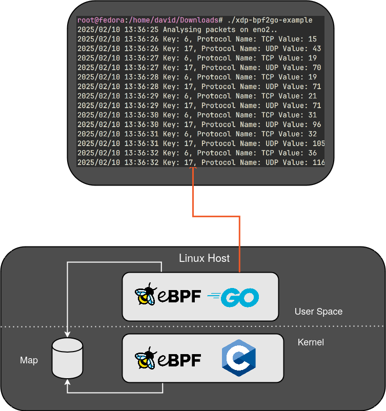

# xdp-bpf2go-example

This examples leverages a `Go` based User Space application that reads from an eBPF map populated with packet protocol information.

The Kernel space application leverages `xdp` to inspect incoming packets and performs the following:

* Check for a valid IP packet
* Extract the `protocol` header value
* Place in a eBPF array map

The protocol header field will contain a [protocol number](https://en.wikipedia.org/wiki/List_of_IP_protocol_numbers) that corresponds to the respective protocol. For example, `ICMP=1`, `IGMP=2`, and so on. 

The Kernel Space application keeps count of each recorded instance of a protocol and stores it into a array map, which can be visualised as:

```
+----------------------------------------------------+
|                 eBPF Array Map                     |
|                                                    |
|  +------+  +------+  +------+  +------+  +------+  |
|  |  0   |  |  1   |  |  2   |  |  ... |  | 254  |  |
|  |------|  |------|  |------|  |------|  |------|  |
|  |  ?   |  |  ?   |  |  ?   |  |  ... |  |  ?   |  |
|  +------+  +------+  +------+  +------+  +------+  |
|                                                    |
+----------------------------------------------------+
```

Where `key` represents the IP Protocol Number, and `value` counting the number of instances.

The Go application reads this map array, and leverages a helper function to map the protocol number to a name and output to stdout:



## To Run:

* Change the interface name if required in main.go

```
go generate

go run .
```

## To Build:

```
go generate 
go build .
```